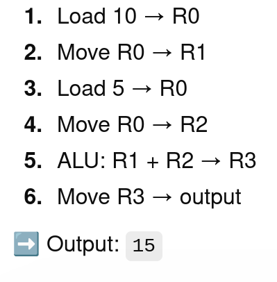

#The 4Loop's repository for collaboriating on challenges in the 2026 VanierHacks hackathon.


Things to do:
```
1. Make team on Discord and ticket [DONE]
2. Make team on website [DONE]
3. Make Java project in repo [DONE]
4. Review challenges and sort
5. Make Java http request template
6. Test Java http request on simplest challenge

For second day:
- http request for website, satellite
- signal in the noise
- alss 1

```


Progress:
```
Junior's Website: ca2bbca1-182a-41c7-ac58-aeabca7cf5da --> code for http request
Peek Inside the Satellite: 
You Know Who to Call: 
```

                              |                                            |                                                          |                     |


```Review challenges and sort into categories```

# Notes and ideas:

CPU process for addition
